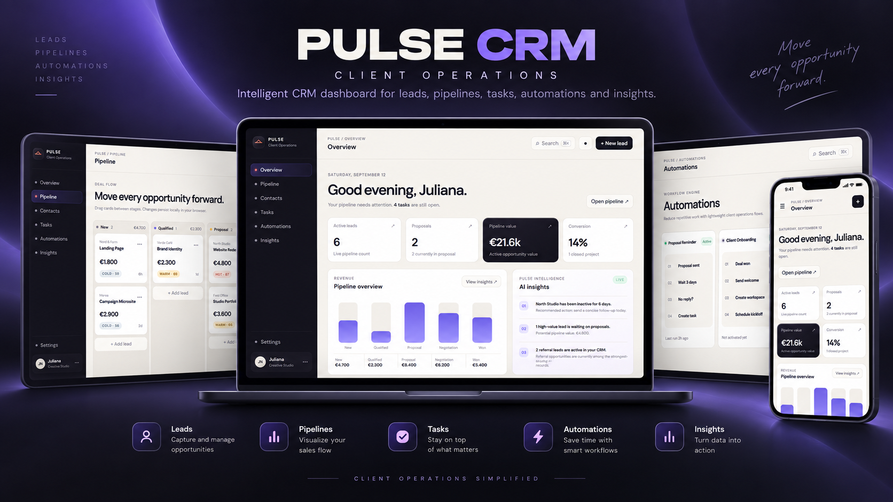
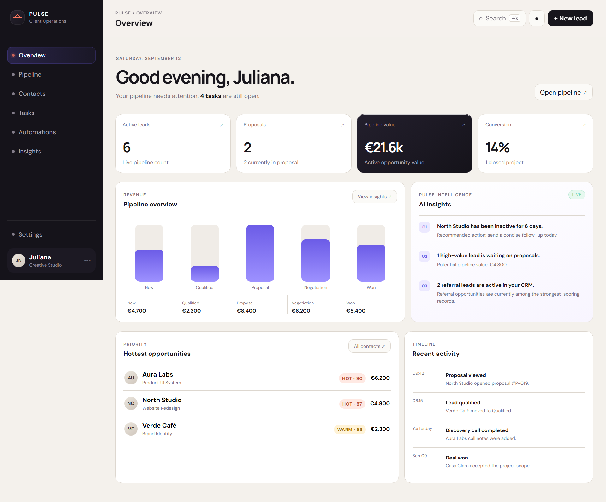
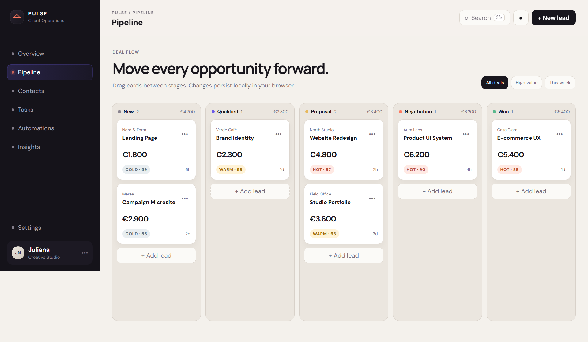
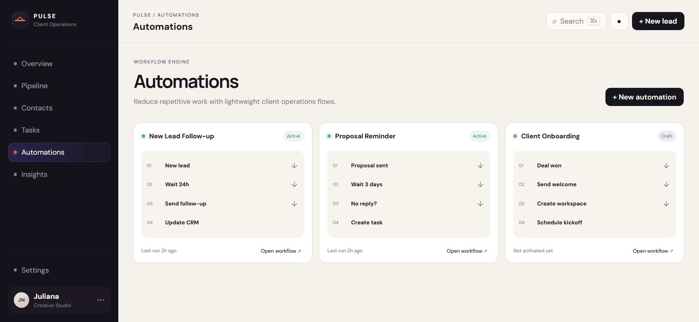
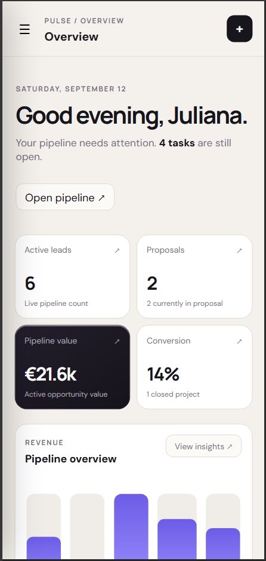

# Pulse CRM — Client Operations



[Live Demo](https://pulse-crm-ruddy.vercel.app) · [View Repository](https://github.com/Lambertiny/pulse-crm)

A responsive CRM product concept for freelancers, creative studios and small agencies. Pulse combines pipeline management, contacts, tasks, lightweight automations and performance insights in one polished front-end experience.

## Current build — v4
- Interactive dashboard with live calculations
- Kanban pipeline with drag and drop
- Lead scoring (HOT / WARM / COLD)
- Searchable and filterable contacts
- Lead detail drawer
- Task creation, filtering and completion states
- Automation creation and workflow detail drawer
- LocalStorage persistence
- Global search shortcut
- Settings panel with demo-data restore
- Responsive desktop and mobile layouts

## Screenshots

### Overview



### Pipeline



### Automations



### Mobile

<p align="center">
  
</p>

---

## Stack

- React
- Vite
- JavaScript
- CSS
- LocalStorage

## Run locally

```bash
npm install
npm run dev
```

On Windows PowerShell, if script execution blocks `npm`, use:

```bash
npm.cmd install
npm.cmd run dev
```

Then open the local Vite URL shown in the terminal.

## Portfolio note

Pulse CRM is a fictional product created as a portfolio case study to demonstrate product design, UI/UX, front-end development, CRM concepts, state management and lightweight automation patterns.


